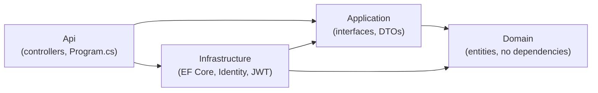

# SmartAPI Forge

[](https://github.com/mburu1/SmartAPI-Forge/actions/workflows/ci.yml)
[](LICENSE)
[](https://dotnet.microsoft.com/)

A production-grade .NET 10 Web API starting point: clean layered
architecture, JWT authentication with refresh-token rotation on top of
ASP.NET Core Identity, a database provider you can swap via configuration
(Postgres, SQL Server, or MySQL), and Scalar for interactive API docs — with
a full test suite, Docker packaging, and CI wired up from the first commit.

## Problem it solves

Every new .NET API starts with the same yak-shave: pick a layering scheme,
wire up Identity and JWTs correctly (refresh rotation is easy to get wrong),
decide how the database provider gets configured, and get Docker/CI in place
before writing a single feature. SmartAPI Forge is that scaffolding, done
once, so a real project can start on day one instead of week two.

## Architecture



See [`docs/architecture.md`](docs/architecture.md) for the full diagram,
request-flow sequence diagram, and the reasoning behind the layering.

## Quick start

### Option A — Docker Compose (API + Postgres + Redis)

```bash
docker compose up --build
```

The API is then available at `http://localhost:8080` (Scalar docs at
`http://localhost:8080/scalar/v1` when `ASPNETCORE_ENVIRONMENT=Development`,
which is what `docker-compose.yml` sets by default).

### Option B — Run locally with `dotnet`

Requires the [.NET 10 SDK](https://dotnet.microsoft.com/download) and a
reachable database (Postgres by default — see `docker-compose.yml` for a
one-off `docker compose up postgres`).

```bash
dotnet restore
dotnet ef database update --project src/SmartAPIForge.Infrastructure --startup-project src/SmartAPIForge.Api
dotnet run --project src/SmartAPIForge.Api
```

This launches on the ports pinned in
[`launchSettings.json`](src/SmartAPIForge.Api/Properties/launchSettings.json)
and opens your browser at Scalar automatically:

| Profile | URL |
|---|---|
| HTTP  | http://localhost:5080 |
| HTTPS | https://localhost:7080 |
| Scalar API reference | `{baseUrl}/scalar/v1` |
| Health check | `{baseUrl}/health` |

### Configuration

`appsettings.json` ships with **placeholder** connection strings for every
provider this project anticipates. `appsettings.Development.json` carries
only a throwaway JWT signing key so `dotnet run` works out of the box
locally — for real connection strings and secrets, use
[user-secrets](https://learn.microsoft.com/aspnet/core/security/app-secrets)
or environment variables instead of editing either committed file. Never
commit real credentials.

```jsonc
"Database": { "Provider": "Postgres" }, // Postgres | SqlServer | MySql
"ConnectionStrings": {
  "Postgres":   "Host=localhost;Port=5432;Username=postgres;Password=YOUR_PASSWORD;Database=smartapiforge",
  "SqlServer":  "Server=(localdb)\\MSSQLLocalDB;Database=smartapiforge;Trusted_Connection=True;TrustServerCertificate=True",
  "MySql":      "Server=localhost;Port=3306;Database=smartapiforge;User=root;Password=YOUR_PASSWORD",
  "MongoDb":    "mongodb://localhost:27017/",
  "Redis":      "localhost:6379"
},
"Jwt": {
  "Key": "REPLACE_WITH_BASE64_256BIT_SECRET", // openssl rand -base64 32
  "Issuer": "SmartAPIForge",
  "Audience": "SmartAPIForge.Clients",
  "AccessTokenMinutes": 15,
  "RefreshTokenDays": 7
}
```

Switching databases is a one-line config change — `Database:Provider` picks
which `ConnectionStrings` entry and EF Core provider get wired up at
startup (see
[`DependencyInjection.cs`](src/SmartAPIForge.Infrastructure/Configuration/DependencyInjection.cs)).
MongoDB and Redis connection strings are present for features that will land
later (see [Roadmap](#roadmap)); Redis is already available as an optional
`IDistributedCache` backend.

## API reference

| Endpoint | Auth | Description |
|---|---|---|
| `POST /auth/register` | — | Create a user, receive an access/refresh token pair |
| `POST /auth/login` | — | Exchange credentials for an access/refresh token pair |
| `POST /auth/refresh` | — | Exchange a valid refresh token for a new pair (rotates the old one) |
| `GET /auth/me` | Bearer token | Returns the authenticated user's profile |
| `GET /health` | — | Liveness check |

Full request/response schemas are generated live via `/scalar/v1` (backed by
.NET's native OpenAPI generator at `/openapi/v1.json`).

## Testing

```bash
dotnet test
```

- **`SmartAPIForge.UnitTests`** — `JwtTokenGenerator`, `RefreshToken`
  domain logic, and `IdentityService` (mocked `UserManager` + EF Core
  InMemory provider).
- **`SmartAPIForge.IntegrationTests`** — `AuthController` exercised
  end-to-end through `WebApplicationFactory<Program>` against the real Api
  host.

CI (`.github/workflows/ci.yml`) runs the full suite plus a Docker image
build on every push and pull request to `master`.

## Project structure

```
SmartAPI Forge/
├── src/
│   ├── SmartAPIForge.Domain/          # Entities, enums — zero dependencies
│   ├── SmartAPIForge.Application/     # DTOs + service interfaces
│   ├── SmartAPIForge.Infrastructure/  # EF Core, Identity, JWT, migrations
│   └── SmartAPIForge.Api/             # Controllers, Program.cs, appsettings
├── tests/
│   ├── SmartAPIForge.UnitTests/
│   └── SmartAPIForge.IntegrationTests/
├── docs/
│   └── architecture.md
├── docker-compose.yml
└── SmartAPIForge.slnx
```

## Contributing

1. Fork and branch off `master`.
2. Keep the layering intact — `Domain` and `Application` must never take a
   dependency on `Infrastructure` or `Api`.
3. Run `dotnet test` before opening a PR; CI will run it again regardless.
4. Open a PR against `master` describing the *why*, not just the *what*.

## Roadmap

The longer-term vision for this project (not yet built, tracked here so the
intent is visible):

- **CLI tool** (`dotnet tool install`) that scaffolds a new API project from
  a schema/config file, reusing this repo's layering as the template.
- **Web dashboard** for real-time endpoint observability (request rates,
  latency, error budgets).
- **Cloud deploy configurators** — Terraform snippets for AWS RDS / ECS and
  Azure App Service, generated alongside the existing Dockerfile.
- **MongoDB-backed features** using the `MongoDb` connection string already
  present in configuration.

## License

[MIT](LICENSE)
