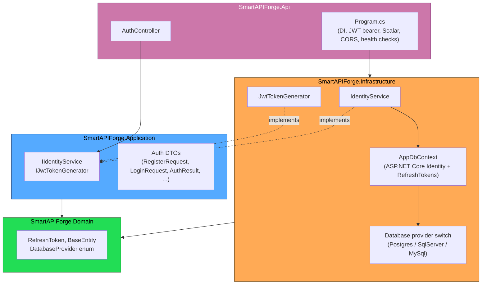
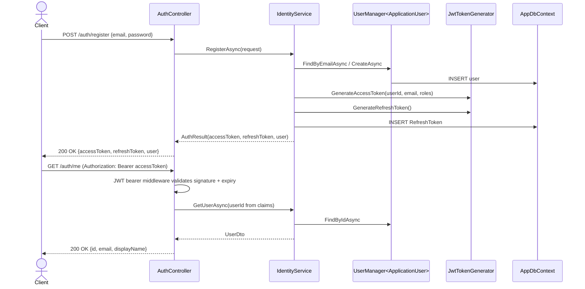

# Architecture

SmartAPI Forge is a layered .NET 10 Web API. Each layer only depends on the
layers "inward" of it — `Api` depends on everything, `Domain` depends on
nothing — so business rules stay testable and swapping infrastructure (a
different database provider, a different token store) never touches
`Domain` or `Application`.

## Why this shape

- **Domain** has zero package dependencies. It only exists to hold the
  handful of concepts every other layer needs to agree on (`RefreshToken`,
  the `DatabaseProvider` enum). Nothing here knows about ASP.NET Core, EF
  Core, or HTTP.
- **Application** defines *what the system does* (`IIdentityService`) without
  saying *how*. Controllers depend on this interface, not on
  `Microsoft.AspNetCore.Identity` directly — so the auth implementation can
  change without touching the Api layer.
- **Infrastructure** is where the framework-specific code lives: EF Core,
  ASP.NET Core Identity's `UserManager`, JWT signing. `ApplicationUser`
  (which extends `IdentityUser<Guid>`) is deliberately kept out of `Domain`
  so the domain model never depends on an Identity framework type.
- **Api** wires everything together in `Program.cs` and exposes it over
  HTTP. It's the only layer that knows about ports, middleware order, and
  configuration binding.

## Request flow: register → authenticated request

## Refresh token rotation

Every refresh consumes the presented token and issues a brand new
access/refresh pair — the old refresh token is marked `RevokedAtUtc` and
linked to its replacement via `ReplacedByToken`, so a leaked, already-used
refresh token can be detected (its `IsActive` becomes `false` the instant
it's redeemed once).

## Multi-database support

The active EF Core provider is selected at startup via `Database:Provider`
in configuration (`Postgres`, `SqlServer`, or `MySql`), each backed by its
own `ConnectionStrings` entry. See
[`DependencyInjection.UseDatabaseProvider`](../src/SmartAPIForge.Infrastructure/Configuration/DependencyInjection.cs)
for the switch. MongoDB and Redis connection strings are present in
`appsettings.json` as placeholders for future use (Redis is already wired
as an optional `IDistributedCache` backend via
`Microsoft.Extensions.Caching.StackExchangeRedis`).

## Testing strategy

- **Unit tests** (`SmartAPIForge.UnitTests`) exercise `JwtTokenGenerator` and
  `IdentityService` in isolation, using Moq for `UserManager<ApplicationUser>`
  and EF Core's InMemory provider for `AppDbContext`.
- **Integration tests** (`SmartAPIForge.IntegrationTests`) boot the real
  `Api` host through `WebApplicationFactory<Program>` and exercise
  `AuthController` end-to-end over HTTP. The EF Core provider is steered to
  `InMemory` via `IWebHostBuilder.UseSetting` rather than swapped after the
  fact in `ConfigureServices` — EF Core registers a relational provider's
  internal services into the container the moment `Program.cs`'s own
  `AddDbContext` options action runs (before any test hook gets a chance to
  intervene), so overriding the *configuration* Program.cs itself reads is
  the reliable way to redirect it.
